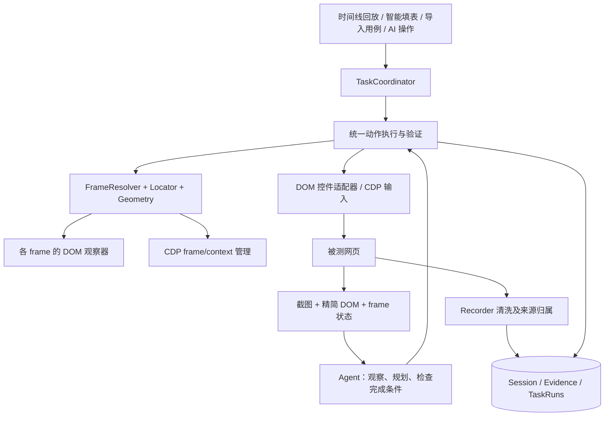

# Midscene 五项能力集成方案

日期：2026-09-24。状态：基础能力及用例导入/DOM Agent 第一版已接入；真实 Chrome 验收和多模态能力仍待完成。

目标分两阶段：先把定位、事件录制、CDP 回放和智能填表的 DOM 上下文做扎实；再在共同执行层上增加结构化用例导入/执行与自然语言自动化测试。四项基础能力应分别改善当前功能，后续能力复用它们。

本方案基于当前 qaChrome 源码，以及本地 Midscene `e4ff31f8b`（根 package.json 版本 1.13.3）。上游源码属于参考基线，能力范围仍需在 qaChrome 中单独验证。

## 当前代码进度

- P1：定位结果包含 frame 路径、CSS zoom 和顶层坐标；父级 content script 通过一次性消息协助跨域嵌套 frame 换算。浏览器提供 `getBoxQuads()` 时使用内容四边形，否则以布局尺寸和视口矩形计算轴对齐缩放。任意旋转、skew、perspective 尚未保证。
- P2：保留已有逐字段 400ms 输入合并和逐容器滚动合并；新增 label/control 伴随点击去重、IME composition 处理、点击前 flush 和录制密码掩码。子 frame 点击、输入、滚动现在进入 Session，并保存 sender 提供的 frameId/frame URL。
- P3：回放尝试附加 Chrome debugger，用 CDP 派发鼠标点击和普通文本输入；debugger 不可用时保留页面事件回放。点击后等待 tab 完成导航，目标切换后尝试重新附加。日期、原生 select、隐藏虚拟选项及滚动仍走现有 DOM 适配；完整 OOPIF debugger session、动作后业务状态验证还未实现。
- P4：沿用 `FormScanner` 的结构化字段，不再另抽一份完整 DOM；OpenAI 兼容模型请求去掉重复字段数据和空约束，选项保留 ID/标签，长当前值截断，密码当前值脱敏。用户资料输入最多发送 8000 字符；尚无真实请求 Token 前后测量。
- P5：新增 Midscene `page/web + tasks/flow` YAML/JSON 受限导入、校验预览与执行。支持 `ai`/`aiAct`、`aiAssert`、`sleep`、`Finalize`；未知节点（包括任意 JavaScript）会带行号报错并阻止运行。执行使用统一任务中心、已有 frame 定向回放和 CDP 输入。
- P6：新增自然语言测试入口；远程模型每轮只能返回一个受限动作，并引用压缩后的可见 DOM 控件 ID。可跨已注入 iframe 观察，密码框和输入值不提供给模型；Agent 会持续执行，直到模型判断完成、发生错误或用户手动停止，不设总动作数和总时长上限。单次模型请求仍有 35 秒超时。断言由模型根据可见页面文字和控件做语义判断。
- P5/P6 当前没有截图输入或多模态模型适配，也不完整兼容 Midscene 的自定义 Node、`aiWaitFor` 和其他平台 flow；Agent 的 `finished` 仍是模型声明，未自动生成业务断言时不会标为 verified。

本轮执行 `npm run lint`（`tsc --noEmit`）通过，未运行测试。坐标、真实 `isTrusted` 行为、跨域导航、Agent iframe 操作和 AntD/Element Plus 交互仍需在 Chrome 页面上验收。manifest 新增 `webNavigation`、`debugger` 权限；重新加载扩展后才能启用新增能力。

## 1. 核对结论与设计前提

### 1.1 当前项目已有的基础

- `src/content/index.ts`：操作采集、逐字段输入防抖、逐容器滚动合并、DOM 回放和元素选择。
- `src/shared/tools/locatorGenerator.ts`：当前已有 CSS/XPath/Playwright 定位器生成。新增 frame 链与坐标转换是在它的基础上扩展。
- `src/content/formScanner.ts`、`formExecutor.ts`：表单快照、节点注册、赋值、回读、取消与撤销。
- `src/background/tasks/taskCoordinator.ts`：全局单任务互斥、步骤进度、任务恢复。
- `src/shared/types/page.ts` 已有 `PageTarget`，但 frame/document 身份尚未贯穿全部消息与事件。
- manifest 已设置 `all_frames: true`，但 Background 的 `RECORD_EVENT` 会过滤子 frame 的普通操作；填表路由也固定 `frameId: 0`。仅改定位函数不能获得完整 iframe 支持。
- `src/ai/index.ts` 当前已实现 `OpenAILlmProviderAdapter`，且 `AIProviderService.remote` 绑定它；旧企业网关适配器仍在文件中。此前调研中的“只有企业网关”结论不准确。
- 当前模型消息仅接受字符串内容，需要新增图像消息、能力检测和 Agent 协议。
- 当前回放成功后同时写入 `actionSent/verified/assertionPassed: true`。集成时必须区分动作发送、页面效果验证、业务断言三种事实。
- 当前 AI 填表送模型的是 `FormScanner` 生成的结构化字段，主要内容是 label、当前值、约束和选项，并未携带大批原始 DOM Rect；要先量测实际请求体和 Token 用量，再判断精简提取的收益。

### 1.2 上游能力的实际边界

| 用户关注点 | 源码核对结果 | 集成处理 |
| --- | --- | --- |
| `parseCSSZoom` | 使用 parseFloat 和缺省值；不是所有缩放情形的完整坐标模型 | 提取思想，建立明确坐标协议并做浏览器标定 |
| iframe offset | offset 累加与向 iframe 内部转换是两个函数；padding 补偿位于向内转换路径 | 统一正向/逆向映射，避免复制出不对称公式 |
| `|>>|` | 表达 frame 路径；DOM 访问跨域失败时会返回 null/停止深入 | 将它作为序列化表示；跨域访问交给 frame 路由/CDP |
| HashId | 基于 rect/content 的指纹，布局和内容变化会使其改变，也存在碰撞可能 | 用于候选缓存；不作跨页面稳定主键 |
| Recorder 防抖 | 上游输入使用单个 timer；qaChrome 已按元素分别防抖 | 保留逐元素优势，只迁移清洗规则 |
| CDP 输入 | 浏览器输入通道，可以产生受信任事件；不是操作系统硬件输入 | 验证实际交互效果，不承诺反爬兼容或全部组件支持 |
| 导航等待 | 上游等待函数超时也 resolve | qaChrome 返回明确 ready/timeout/interrupted 状态 |
| `<planning>` | 标准规划模板的输出随 includeThought、includeSubGoals 和模型协议变化 | 定义自己的结构化协议；XML 只是可选适配格式 |

## 2. 集成方式

采用“有来源记录的定向移植 + qaChrome 适配层”。定位、DOM 过滤、事件清洗、键盘映射中可独立复用的实现迁入项目；frame 管理、任务生命周期、存储和模型调用由 qaChrome 管理。

理由：现有 Session、表单预览、取消、撤销和 Bug 证据都已经有业务语义。直接接入完整 Midscene Agent 会同时引入另一套页面控制、任务状态和模型配置，需要更大的迁移。基础能力集中到统一接口后，结构化用例和自然语言 Agent 可依次建立在上面。

复用文件标注来源仓库、commit、原路径、修改说明；随产物保留对应许可文件。特别注意 `cdpInput.ts` 含 Puppeteer 来源的 Apache-2.0 声明，不能只保留 Midscene 根目录 MIT 文本；实施时一并检查键盘布局等被复制依赖的声明。



## 3. 先统一数据和坐标协议

### 3.1 目标身份

每次观察与操作至少携带：

```ts
interface DocumentTarget {
  tabId: number;
  chromeFrameId: number;
  documentId: string;
  framePath: FrameLocator[]; // 父 frame 中 iframe 元素的定位链
}

interface ElementRef {
  observationId: string;
  target: DocumentTarget;
  elementId: string;        // 当前 observation 内唯一
  fingerprint?: string;     // 缓存候选，不代替 elementId
  locators: LocatorCandidate[];
  rectInFrameViewport: Rect;
  rectInTopViewport?: Rect;
}
```

CDP 额外维护 `cdpFrameId/targetId/sessionId/executionContextId`。这些 ID 与 Chrome 扩展的数字 frameId 属于不同命名空间，必须显式映射。

Chrome frame 信息来自 content 注册、消息 sender 与 webNavigation；CDP frame 信息来自 Page/Runtime/Target 事件。两套信息通过父子关系、frame owner 和一次性文档探针关联，禁止只凭 URL 匹配：多个 iframe 可以加载同一地址。

documentId 限定当前文档；刷新、跨文档导航、frame 替换后，节点缓存和 observation 立即失效。历史回放使用 framePath 重新查找当前 frame，再取得新的 frame/document ID；不能复用上次运行的 frameId。

### 3.2 坐标空间

明确区分：frame viewport CSS 像素、顶层 viewport CSS 像素、页面文档坐标、截图像素、模型归一化坐标。每个 rect/point 必须声明空间和 observationId。

- CDP 鼠标动作入口统一接收顶层 viewport CSS 像素。
- `getBoundingClientRect()` 已包含部分布局、滚动和缩放效果，不再无条件叠加 scroll 或乘 zoom/DPR。
- iframe 局部点通过 frame 内容区域的映射递归换算；border/padding 用于确定内容原点，父子滚动由各层当前测量处理。
- 截图记录 viewport、实际图片尺寸、裁剪范围、缩放比例及 visualViewport 信息。模型点先回到原截图，再映射到顶层 viewport；不直接乘 devicePixelRatio。
- 第一阶段支持嵌套 iframe、轴对齐 CSS zoom/scale、border/padding 和滚动。旋转、skew、perspective 需要内容四边形映射；未通过验收时返回 unsupported，不用轴对齐矩形中心冒充精确位置。
- 真正点击前重新测量并做可见区域和遮挡命中检查；滚动、resize、zoom 或页面布局变化后丢弃旧坐标。

## 4. 五项能力的具体接入

### 4.1 跨 iframe 定位与坐标

新增 `src/shared/browser/geometry.ts`、`locator.ts`；新增 `src/background/browser/frameRegistry.ts`、`frameResolver.ts`；新增 `src/content/browser/frameAgent.ts`。

定位流程：解析 framePath → 确认当前 document → 在对应 frame 中解析局部定位器 → 唯一性校验 → 计算可见点击点 → 验证命中目标。

候选定位器优先使用唯一 testId、role/name、label、CSS，XPath 作为候选之一；视觉坐标定位记录独立来源。`|>>|` 用于导出、日志和旧格式兼容，内部使用结构化数组，避免字符串解析承担所有路由职责。XPath 文本含单双引号时使用安全字面量构造；开放 Shadow DOM 另用 shadow 路径段，不能假定 XPath 自动穿透。

同源 iframe 可用 DOM 递归优化；跨域 iframe 由有访问权限的 content script 在各自文档内解析，经 Background 定向调用。CDP 模式同时处理同进程 frame 的 execution context，以及 OOPIF 的独立 target/session。受限文档和无法注入的 frame 显示 unavailable，不随机落到顶层页面。

接入点：元素选择器、事件采集目标、回放目标、FormSnapshot、填表/撤销消息全部携带目标身份；移除当前顶层 frame 硬编码，改为明确选择一个表单范围及其 frame。

### 4.2 精简 DOM 观察与过滤

新增 `src/content/browser/extractor.ts`、`elementRegistry.ts` 和 `src/shared/browser/observation.ts`。现有表单扫描器复用它的可见性、label、rect 和目标身份，但保留字段约束、选项与原值等填表数据。

输出按业务用途排序：可操作控件、当前弹窗、校验消息、关键文本、普通文本；提取 role、name、label、placeholder、value、disabled/readonly、rect、定位候选。设置节点数和文本预算，初始建议最多 300 个节点、普通节点文本 200 字符，预算可配置并记录截断信息。

现有 `planFormFill` 使用的字段快照已经较紧凑，因此先记录一批真实表单的发送字节数、字段数、重复信息比例和模型 Token 用量。优先删掉重复标签及无关候选；Rect 只在视觉定位需要时附带，做数值量化也必须留足点击精度。新 extractor 用于页面观察时可包含关键文本，用于填表时必须保留当前值、约束、选项和来源 fieldId。不能为了缩小请求体丢失填表依据，也不预先承诺具体节省比例或命中率提升。

不能把“占满屏幕”当作统一删除条件：Canvas、全屏编辑器和弹窗可能是目标。仅过滤无交互语义的背景容器；小按钮、图标按钮依据语义保留。隐藏/离屏候选不混入当前可点击列表，滚动后重新观察。完整填表原值保存在执行数据里，不能被模型摘要的字符上限截断。

`elementId` 在一次观察内唯一；fingerprint 带 frame/document 命名空间，缓存命中后重新验证连接状态、属性、可见性和唯一性。重复文本、相同尺寸控件、布局变化都不能仅凭 hash 匹配。

### 4.3 事件录制与清洗

新增 `src/content/recorder/normalizer.ts`、`batcher.ts`、`automationContext.ts`。逐步把 `content/index.ts` 中的采集逻辑拆入这些模块。

- Label 去重：利用 label.control、htmlFor 和包含关系，把同一 document、同一控件、同一次激活引起的 label/input 两次 click 合并。不能仅依据“最近一次 label”或相同文本去重，避免吞掉第二次真实点击。
- Checkbox/radio：动作归一为一次“设置最终 checked 状态”，保留必要原始证据，但不把 click 和 change 各执行一次。
- 输入：保留当前逐元素 400ms 防抖；增加 IME composition 处理。blur、后续点击、停止 Session、导航边界触发 flush，确保输入先于提交点击入库。
- 滚动：保留逐容器合并，采用约 160ms 尾触发和最大等待时间，长滚动保留中间进度与最终位置。不同 frame/容器不能相互覆盖。
- 元素边界：优先使用 composedPath 中的业务可交互节点，处理按钮内部 SVG/文字和开放 Shadow DOM；同时记录实际点击点，避免把容器大矩形当作业务节点。
- 事件顺序：每个文档维护递增 sequence；Background 按 document/sequence 去重并确认 flush；页面卸载的最后一批无法保证送达时记录缺口，不假称完整录制。

**CDP 事件归属必须提前解决。** CDP 动作也可能产生 `isTrusted=true` 事件。执行前向目标 frame 发送 runId/stepId 与预期交互，收到就绪回执再派发输入；采集器据目标、动作类型和时序归属自动动作，在动作结束或导航时关闭上下文。不能只沿用现有固定时长的 replaySuppressedUntil。

来源无法可靠区分的并发人工操作应触发任务暂停/冲突，不能一概丢弃。自动动作生成一条规范步骤，相关网络证据通过 runId/stepId 关联，避免录制回放再录自身。

新录制的密码输入事件现在保存 `value='*****'` 和 `sensitive=true`，回放时要求人工补填；历史事件不改写。智能填表快照仍在本地保留原值以兼容预览、执行和撤销，但发送到 OpenAI 兼容接口或 AI 网关前会遮蔽密码当前值，侧边栏也不显示原值。更完整的 secretRef、导出变量和历史存储策略仍需另行设计；只遮模型上下文不代表本地存储已脱敏。

### 4.4 CDP 原生仿真输入

新增 `src/background/browser/debuggerSession.ts`、`cdpInput.ts`、`navigationTracker.ts`；新增 `src/background/execution/actionExecutor.ts` 和 `verifier.ts`。

Debugger 只在用户启动需要它的执行任务时 attach，由 Background 统一管理。普通采集继续使用现有管线。全局任务锁负责回放、填表和 Agent 的互斥。

| 动作 | 实现与验证 |
| --- | --- |
| Tap/DoubleTap/Hover | 鼠标 move/press/release，点击前确认命中目标；结束后重新观察 |
| Input | 聚焦并验证目标；明确 replace/append/typeOnly；快捷键用 dispatchKeyEvent，普通 Unicode 文本可用 insertText；等待稳定后回读 |
| KeyboardPress | 维护 modifier 状态；取消/异常后释放尚未释放的按键 |
| Scroll | 在目标滚动区域发 wheel，观察实际滚动变化，避免滚到错误容器 |
| Drag | 按下、连续移动、释放；检查目标状态，取消也必须释放鼠标 |
| Check/Select/SetDate | 由控件适配器声明支持能力；原生 select、组合键和组件菜单分别实现，不把设置 value 算成完整用户交互 |

DOM 与 CDP 是明确的执行策略。DOM 适合可验证的基础控件；CDP 用于需要真实输入序列的交互。策略在动作前决定，结果未知时先重新观察，不在已点击后静默换策略再点一次。

导航追踪先注册监听再执行动作，结合 tab 状态、frame/document 更新及页面就绪探测；SPA 路由、完整跳转、跨域重定向分开处理。导航事件在短等待窗口内未出现时，仍继续观察新文档事件；不拿 networkIdle 作为所有业务页的硬门槛。

读操作和重新定位可有限重试；点击/输入已经发出但响应丢失时标为 outcome_unknown，并先回读，防止重复提交。DevTools 冲突、用户主动取消 debugger、标签关闭需要中断/暂停并解释；用户主动 detach 后不自动重连。attach 报另一个 debugger 已存在时也不能当作本插件已持有连接。

建议把完整增强执行版最低 Chrome 版本提升到 125，以使用 debugger flat sessions。同进程 frame 用 Runtime context，OOPIF 用递归 Target.setAutoAttach；自动附加仅覆盖直接相关子 target，需要对子 session 继续设置。升级 `@types/chrome` 至能表达所需接口的版本并锁定依赖，保持构建类型检查。[Chrome debugger 官方文档](https://developer.chrome.com/docs/extensions/reference/api/debugger)

manifest 增加 debugger 和 webNavigation 权限，更新最低版本；把 debugger 的用途、浏览器提示及 DevTools 冲突写入使用说明。若必须保留 Chrome 116，增强执行需要单独能力门控，不能声称完整 OOPIF 支持。

### 4.5 多模态 Agent

当前已交付 DOM 文本版首轮：侧边栏“自然语言”连接已有远程 OpenAI 兼容模型；观察器提取有限的页面文字和可见控件，模型每次只能规划 tap/input/scroll/finished 或语义 assertion，执行器只允许引用当前观察中存在的元素 ID。请求最多携带 8 个 frame、100 个交互候选和 6000 个页面文字字符；禁止任意脚本和模型自选 CSS selector。密码字段与表单当前值不在观察内容内。Agent 没有总动作数和总运行时长上限，直到模型返回完成、执行报错或用户手动取消；单次模型请求最多等待 35 秒，任务仍可由现有任务中心取消。

本版没有截图、多模态图片消息、动作请求中断、模型能力探测或 OOPIF CDP session 管理；远程 API 单次请求超时沿用 35 秒。滚动动作必须引用本轮观察到的 frameId，避免把 iframe 内滚动误发到顶层页面。Midscene YAML `ai`/`aiAssert` 会经同一个 DOM Planner 执行和判断。进入视觉 Agent 前仍需补全下述规划、截图、验证、恢复和权限设计。

新增 `src/background/agent/agentRunner.ts`、`observer.ts`、`completionChecker.ts`；新增 `src/ai/planning/prompt.ts`、`schema.ts`、`parser.ts`；Side Panel 新增“AI 操作”入口。

此阶段建立在 4.6 的用例执行协议之上：`aiAct` 以受约束的动作调用同一个执行器，`aiAssert` 读取同一个观察/验证接口。自然语言任务也生成相同的运行记录，避免维护两种回放语义。

基于当前 OpenAI 兼容连接扩展独立 `PlanningProvider`，支持图像消息、请求取消、模型能力探测和明确的坐标输出协议。文字模型可以继续生成 Bug/填写方案；视觉 Agent 要求模型确实支持图像与定位，不能凭模型名称或文本 pong 连接测试宣布可用。设置中增加视觉规划模型配置，可与现有连接复用地址和凭据。

每轮输入：用户目标、允许的动作、当前截图、精简 DOM、frame 状态、最近步骤结果和有上限的历史摘要。页面文本作为待分析资料，不得覆盖用户任务和执行器约束。

```text
Observe → Plan one action → Schema/target validation
        → Locate → Execute → Re-observe/verify
        → Continue / Completed / Failed / Cancelled / Interrupted
```

统一输出用判别联合：action、finished、blocked/error；每轮最多执行一个动作。动作白名单为 Tap、Input、Scroll、KeyboardPress、Hover、Drag、Wait；Check/Select/SetDate 可由确定性填表动作转换。模型只能引用本次观察的 elementId 或按声明坐标系给出位置，不输出任意 JavaScript、CDP method 或任意网络调用。

`<planning>` 可由模型适配器解析为简短观察/行动摘要，但执行器依赖的是结构化动作和证据。不同模型支持 JSON Schema 或 XML 时分别解析，最终都通过运行时 schema 校验；不把自由文本推理作为必须存储或展示的执行依据。

后续视觉 Agent 建议预算：最多 20 个动作轮次、单次模型请求 45 秒、总运行 5 分钟；可配置。协议格式错误最多纠正一次；同一目标动作连续无进展 3 次停止。恢复不是重复点击，优先重新观察、定位、等待或滚动。

完成判定分三层：命令已发送、预期页面变化已观察、用户要求的完成条件已验证。AI 的 Finished 只是完成声明；completionChecker 必须检查当前状态和执行历史。对于用户明确要求的顺序步骤，要有对应动作记录。未配置业务断言时标为“操作完成”，不写 assertionPassed=true。

后续完整 Agent 中，用户指令与模式决定允许范围：智能填表仍按其既有语义执行且不自动提交；AI 操作按用户明确要求允许导航/提交，不能由网页内容自行扩大任务。当前 DOM 版不允许模型直接导航 URL，但会执行用户目标明确要求的网页点击/输入。

### 4.6 结构化用例导入与执行

第一版已按本地 Midscene Web 导出格式实现 `page`/`web`、`tasks[].flow[]` 子集，在 AI 工具箱中提供文件导入、编辑、校验、预览和执行；解析器支持 JSON 以及不带自定义标签/锚点的常用块状 YAML。节点为 `ai`/`aiAct`/`aiAction`、`aiAssert`、`sleep`、`Finalize`。未知节点会明确报错，整个文件不会部分执行。当前步骤失败即停止，不支持 `continueOnError`。

执行绑定当前活动标签页；存在 `page.url`/`web.url` 时按文件指定网址导航。步骤显示在现有任务状态中，`aiAssert` 记录断言结果。此版本不是 Midscene Test `cases/steps` 协议，也不支持任意固定 locator 步骤、`aiWaitFor`、JavaScript、自定义 Node、hooks 或外部 API setup。

后续可扩展显式版本化的 `cases/steps` 固定步骤协议。完整解析和校验后才允许执行，并继续复用统一动作执行器与 Verifier。

导入预览列出全部解析步骤、目标地址和校验错误；点击执行后在当前标签页按顺序运行，任一步失败就停止。YAML 错误带源行号，JSON 结构错误标明任务与步骤位置。该格式兼容的是 Midscene Web `tasks/flow` 子集，不宣称兼容 Midscene Test `cases/steps`。

## 5. 持久化、恢复与老数据兼容

- 新增 taskRuns/taskSteps/observations 表；记录 runId、stepId、目标、动作来源、前后 observation、耗时、错误、执行/验证状态。
- 当前第一版复用 `runner_test` 任务类型；后续执行记录持久化时再拆分 `agent` 和用例 Runner 类型。
- 将步骤写入与结果归档交给 Background，Side Panel 只展示。当前填表结果由页面收到后入库的路径需要迁到后台，避免关面板丢失结果。
- 动作发送前写入 pending，发送后记录 dispatched，观察后写入 verified 或 outcome_unknown。Worker 重启后，未确认写操作统一中断，不自动重发。
- 活跃 debugger session 从 Chrome 118 开始可帮助维持 Service Worker 生命周期，但崩溃、扩展重载仍需处理；不依赖定时空消息保证正确性。[Service Worker 生命周期](https://developer.chrome.com/docs/extensions/develop/concepts/service-workers/lifecycle)
- 页面关闭、document 改变、取消、调试连接失效都进入明确终态；释放按键、鼠标和 debugger 连接。
- 旧 QAEvent 无 frame 元信息时按 legacy 顶层记录处理；目标唯一性不足时提示无法定位，不全页面猜测。新事件新增版本及来源字段，保留原有 ID 和 Session 关联。
- Dexie 从当前版本 7 递增：第一步补充事件版本和 frame 索引；第二步新增执行/观察表。迁移不要求旧记录拥有可推导不出的 documentId。
- observation 截图独立存储并按运行限制数量/体积；任务表保存引用，避免每条消息重复携带 Base64。
- 回放导出器同步支持 frameLocator 链、密码变量和未验证步骤说明。代码导出不转化为“已验收测试”。

## 6. 改动范围

| 位置 | 计划改动 |
| --- | --- |
| `src/shared/types/{page,event,task,formFill}.ts` | 目标身份、坐标、来源、步骤结果、Agent 类型 |
| `src/shared/messages/index.ts` | frame 注册、定向观察、动作准备/完成、取消/状态查询 |
| `src/shared/browser/*` | 定位描述、坐标换算、观察协议 |
| `src/content/browser/*` | frame 本地提取与元素注册 |
| `src/content/recorder/*` | 去重、batch、自动操作归属 |
| `src/content/{index,formScanner,formExecutor}.ts` | 抽离公共能力，接入 frame-aware 执行 |
| `src/background/browser/*` | frame/context/CDP session/导航管理 |
| `src/background/execution/*` | 动作策略、执行、验证 |
| `src/background/agent/*` | Agent 循环与预算 |
| `src/shared/testCase/*`、`src/background/testCase/*` | YAML/JSON 校验、内部步骤协议、用例运行 |
| `src/background/{index,tasks/taskCoordinator}.ts` | 分拆回放调度，统一任务状态和持久化 |
| `src/ai/index.ts`、`src/ai/planning/*` | 扩展多模态协议并逐步拆分 provider |
| `src/sidepanel/pages/*` | 用例导入预览、AI 操作入口、frame 选择、执行报告、能力设置 |
| `src/db/*` | 版本迁移、执行和观察仓储 |
| `src/shared/formatters/playwrightExport.ts` | 跨 frame 导出与执行状态说明 |
| `public/manifest.json`、`docs/adr/*` | 权限/版本和新的执行策略决策 |
| `docs/third-party/*` | 上游来源、许可及修改记录 |

## 7. 实施顺序与验收门槛

| 阶段 | 交付 | 进入下一阶段的条件 |
| --- | --- | --- |
| P0 协议与浏览器技术验证 | frame/document 映射、坐标规范、最小 CDP 原型 | 同源/跨域嵌套页面能唯一定位；截图点与点击点一致 |
| P1 定位器增强 | Geometry、FrameResolver、节点定位；先接入页面定位器 | 缩放、滚动、重复控件、刷新失效按标准处理 |
| P2 录制质量 | Label 清洗、现有逐字段/容器 batch 优化、顺序 flush | 无重复 label 激活；不同输入框不丢值 |
| P3 CDP 回放 | 统一动作结果、CDP 输入、导航保护、取消恢复、自动操作来源归属；接入现有回放 | 复杂控件有实际回读；动作失败/未知不虚报成功；CDP 动作不重复录制 |
| P4 填表上下文 | 精简 DOM 观察和填表字段信息，复用定位/执行基础 | 记录优化前后 Token 与字段命中；约束/选项/原值不丢失 |
| P5 结构化用例 | 已有 `tasks/flow` AI 步骤 YAML/JSON 导入、预览与执行；后续增加固定 `cases/steps` 节点 | 实际 Midscene Web 导出可导入；未知节点显式拒绝；固定 locator/断言步骤仍待补充 |
| P6 自然语言测试 | 已有 DOM 文本单步规划与受限执行；后续增加截图、多模态模型、完成验证和执行报告 | `ai`/`aiAssert` 共用回放；预算和任务取消生效；视觉能力需单独验收 |
| P7 发布与迁移 | 老数据迁移、导出器、权限说明、集成验收 | 现有取证/网络/禅道流程无回退；新增支持范围有真实 Chrome 证据 |

P0 先消除坐标和 OOPIF 的技术不确定性；P1—P4 分别交付用户能感知的基础功能；P5 用固定用例检验执行底座；P6 再让模型在同一底座上规划动作。P4 的观察器技术验证可与 P1 同步进行，但智能填表请求的正式替换在记录基线数据后完成。

验收场景至少包括：

1. 三级 iframe；同域/跨域交替；两个同 URL iframe；OOPIF；frame 动态删除和替换。
2. CSS zoom 0.8/1/1.25/1.5/2，浏览器缩放，DPR 1/2，iframe border/padding、父子滚动、截图缩小及裁剪。支持的轴对齐样例数学映射误差目标不超过 1 CSS px，并且真实点击命中正确元素。
3. 全屏 Canvas、全屏编辑器、弹窗、遮罩、图标按钮、重复文本、开放 Shadow DOM；不支持的复杂变换明确报告。
4. label 显式/隐式关联、连续两次真实点击、checkbox/radio 最终状态、IME、多个输入框快速切换、停止录制前最后一次输入。
5. React/Vue 受控输入、中文/emoji、原生 select、自定义下拉、滚动、拖拽、跨域重定向与 SPA 跳转。组件通过单独用例后才声明支持。
6. CDP 自动动作与人工操作交错、debugger 被用户取消、DevTools 冲突、Worker 重启、目标 tab 关闭、Side Panel 重开。
7. AI 返回未知动作、错误 elementId、越界坐标、过期 observation、伪完成、重复动作；模型无图像能力；预算耗尽；取消模型请求。
8. 历史 Session/填表数据正常打开；新增步骤不会把未知结果写成成功，未做断言不会显示业务通过。
9. Midscene Test `cases/steps` 子集的正常导入、非法文件定位、未知 Node 拒绝；同一用例两次运行均保留独立报告。

纯逻辑用单测验证；坐标、isTrusted、OOPIF、导航和框架状态必须用真实 Chrome 验收。先用固定规划响应验证执行器，最后再做真实多模态模型联调，避免用模型随机性掩盖执行缺陷。本次仅制定这些标准，未运行测试。

## 8. 本方案建议采用的产品选择

1. 先交付四项基础能力：定位器、录制清洗、CDP 回放、填表上下文；再交付结构化用例导入/执行和自然语言自动化测试。
2. Chrome 125+ 作为完整增强执行基线；每项不支持能力明确展示原因。
3. 结构化用例 Runner 与 Agent 均由 Background 驱动，不强制安装本地服务；当前先支持 Midscene Web 的 `tasks/flow` AI 节点子集，后续再扩展固定 `cases/steps`。
4. 复用当前模型连接，额外配置支持截图和定位的视觉模型；不预设默认文字模型具备此能力。
5. 密码策略存在历史约定与本次参考描述的差异，建议独立开关并严格区分展示掩码、原值保留和执行变量；实施前明确默认值。

## 9. 主要参考

- `开源参考项目/midscene/packages/shared/src/extractor/locator.ts`
- `开源参考项目/midscene/packages/shared/src/extractor/{web-extractor,util,dom-util}.ts`
- `开源参考项目/midscene/packages/recorder/src/recorder.ts`
- `开源参考项目/midscene/packages/web-integration/src/chrome-extension/{page,cdpInput}.ts`
- `开源参考项目/midscene/packages/core/src/ai-model/prompt/planning/{system-prompt,action-space-description}.ts`
- [Chrome debugger：frame 与 child sessions](https://developer.chrome.com/docs/extensions/reference/api/debugger)
- [Chrome webNavigation：frame/document 生命周期](https://developer.chrome.com/docs/extensions/reference/api/webNavigation)
- [CDP Input](https://chromedevtools.github.io/devtools-protocol/tot/Input/)
- [Chrome Service Worker 生命周期](https://developer.chrome.com/docs/extensions/develop/concepts/service-workers/lifecycle)
